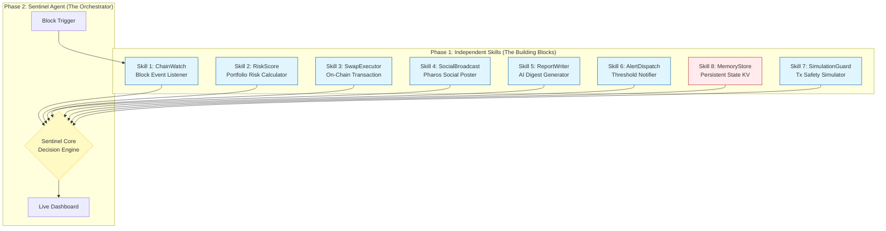

# PHAROS SENTINEL: Autonomous On-Chain Intelligence & Risk Agent

## 🏆 Executive Summary
**PHAROS SENTINEL** is a modular, autonomous AI agent ecosystem designed for the Pharos network. It acts as a real-time on-chain analyst and portfolio guardian, monitoring wallets, executing risk-defined swaps, broadcasting to the social layer, and generating AI-powered activity reports. 

Built on a **Dual-Cascade Architecture**, the project delivers **7 independent, reusable Skills** in Phase 1 and composes them into a fully autonomous **Sentinel Agent** in Phase 2. This approach maximizes winning potential by targeting both the "Best Skill Module" and "Best Autonomous Agent" categories.

### Core Value Proposition
- **For Users:** Automated portfolio protection, real-time risk alerts, and social-sharing of on-chain activity.
- **For Developers:** A library of 7 production-ready, composable Skills (Oracle, Risk, Execution, Social, AI, Alerting, State) that can be reused in any Pharos agent.
- **For Pharos Ecosystem:** Demonstrates the full trifecta of Pharos capabilities: **On-Chain Payments**, **Social Interactions**, and **Scalable Agent Deployment**.

---

## 🏗 High-Level Architecture (HLD)

The system follows a **Event-Driven, Skill-Based Architecture**. The Agent is not a monolith but an orchestrator that chains discrete, stateless Skills together.

### Architecture Diagram

### Data Flow: The "Risk-Rebalance-Broadcast" Loop
1.  **Listen:** `ChainWatch` detects a wallet event or scheduled tick.
2.  **Analyze:** `RiskScore` calculates current portfolio health (0-100).
3.  **Decide:** If `Risk > Threshold`, the Orchestrator triggers a rebalance plan.
4.  **Simulate (NEW):** `SimulationGuard` runs a dry-run of the proposed swap to ensure no slippage loss or revert.
5.  **Execute:** `SwapExecutor` signs and broadcasts the transaction.
6.  **Report:** `ReportWriter` generates an AI summary of the action.
7.  **Broadcast:** `SocialBroadcast` posts the summary to Pharos Social.
8.  **Alert:** `AlertDispatch` sends a Telegram/Discord notification if critical.
9.  **Store:** `MemoryStore` saves the state for historical analysis.

---

## 🧩 Phase 1: The 8 Skill Modules
*Each skill is a standalone submission with its own README, test suite, and NPM package.*

| # | Skill Name | Type | Input Contract | Output Contract | Winning Factor |
|---|---|---|---|---|---|
| 1 | **ChainWatch** | Listener | `{ wallets: [], eventTypes: [] }` | `{ event, wallet, amount, txHash }` | Pure utility, zero side-effects, essential for any agent. |
| 2 | **RiskScore** | Compute | `{ holdings, priceHistory }` | `{ score, level, breakdown, recommendation }` | Complex math logic, reusable for any DeFi dashboard. |
| 3 | **SwapExecutor** | Action | `{ from, to, amount, slippage, key }` | `{ status, txHash, amountOut, gas }` | The core "Payment" primitive for the ecosystem. |
| 4 | **SocialBroadcast** | Interaction | `{ message, tags, attachTx }` | `{ postId, url, timestamp }` | Bridges agents to the "Social" pillar of Pharos. |
| 5 | **ReportWriter** | AI/LLM | `{ events, period }` | `{ title, summary, markdown }` | Showcases LLM integration + on-chain data. |
| 6 | **AlertDispatch** | Notification | `{ rules, currentData }` | `{ triggered, sentTo, alertId }` | Configurable notification layer for any app. |
| 7 | **SimulationGuard** | **Safety** | `{ txData, rpcUrl }` | `{ safe: bool, estimatedGas, revertReason }` | **Critical differentiator:** Prevents agent bugs from losing funds. |
| 8 | **MemoryStore** | State | `{ op, key, value }` | `{ ok, value, lastUpdated }` | Enables stateful agents in a stateless environment. |

---

## 🚀 Phase 2: The Sentinel Agent
The Phase 2 submission is the **Orchestrator** that binds these skills.

### Key Features
- **Autonomous Loop:** Runs every block or on webhook trigger.
- **Configurable Personas:** Via `ReportWriter` prompts (e.g., "Conservative Guardian" vs "Aggressive Trader").
- **Safety First:** No transaction executes without passing `SimulationGuard`.
- **Live Dashboard:** A React UI showing real-time risk scores, recent actions, and social posts.

---

## 🛠 Tech Stack
- **Runtime:** Node.js / TypeScript (for Skills), Python (optional for LLM heavy lifting)
- **Blockchain:** Pharos SDK, Ethers.js/Viem
- **Storage:** Redis (hot cache), Pharos On-Chain Storage (cold state)
- **AI:** OpenAI API / Local Llama (for ReportWriter)
- **Testing:** Jest (Unit), Hardhat/Foundry (Integration)
- **Deployment:** Docker containers, GitHub Actions for CI/CD

---

## 📅 Timeline Alignment
- **June 8-15:** Develop and submit Skills #1, #2, #6, #7 (Off-chain/Safe).
- **June 16:** Submit Skills #3, #4, #8 (On-chain integration).
- **June 23-July 6:** Build Orchestrator, Dashboard, and run live demo on Testnet.
- **July 24:** Final Agent Arena submission.

---

## 🏆 Why This Wins
1.  **Volume & Quality:** 8 distinct entries for Phase 1 increases probability of winning multiple prizes.
2.  **Safety Narrative:** `SimulationGuard` addresses the #1 fear of autonomous agents (losing money).
3.  **Ecosystem Fit:** Perfectly aligns with Pharos' three pillars (Payments, Social, Agents).
4.  **Composability:** Other hackers will use our skills, creating network effect votes.
