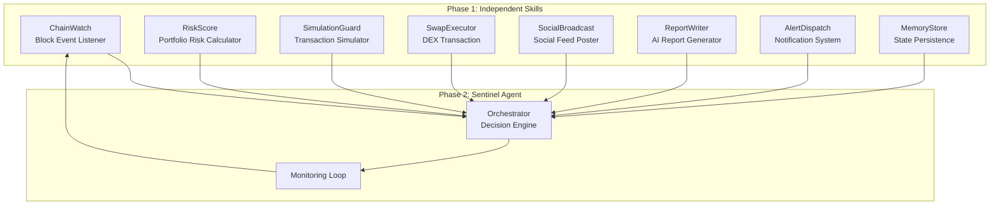
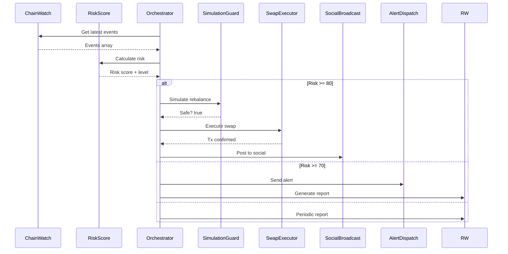

# 🛡️ PHAROS SENTINEL

## Autonomous On-Chain Intelligence & Risk Agent

**Built for the Pharos Skill-to-Agent Dual Cascade Hackathon**

[](https://opensource.org/licenses/MIT)
[](https://www.typescriptlang.org/)
[](https://pharosnetwork.xyz/)

---

## 📋 Table of Contents

- [Overview](#overview)
- [Architecture](#architecture)
- [Phase 1: Skills](#phase-1-skills)
- [Phase 2: Agent](#phase-2-agent)
- [Quick Start](#quick-start)
- [Usage Examples](#usage-examples)
- [Demo](#demo)
- [Team](#team)

---

## 🎯 Overview

**Pharos Sentinel** is an autonomous AI agent that acts as a real-time on-chain analyst and portfolio guardian. It monitors wallets, executes risk-defined swaps, sends social alerts, and auto-composes activity reports — all built from composable Skills stacked into a living Agent.

### Key Features

- 🔍 **Real-time Monitoring**: Watches wallet activity across the Pharos network
- 📊 **Risk Analysis**: Calculates composite risk scores using volatility, concentration, and liquidity metrics
- 🛡️ **Safety First**: Pre-execution transaction simulation prevents losses
- 🔄 **Auto-Rebalancing**: Automatically rebalances portfolios when risk thresholds are breached
- 📱 **Social Integration**: Posts activity updates to Pharos social layer
- 🤖 **AI-Powered Reports**: Generates human-readable digests using LLMs
- 🔔 **Smart Alerts**: Sends notifications via Telegram, Discord, or webhooks

---

## 🏗️ Architecture



### Design Principles

1. **Modularity**: Each Skill is independently submittable and testable
2. **Composability**: Skills can be combined in infinite ways
3. **Safety**: SimulationGuard prevents autonomous agents from losing money
4. **Transparency**: All decisions are logged and stored in MemoryStore

---

## 🧩 Phase 1: Skills

### 1. ChainWatch ⛓️
**Block Event Listener** - Subscribes to Pharos RPC WebSocket and filters wallet events

```typescript
import { chainWatch } from '@skills/chainwatch';

const result = await chainWatch.execute({
  wallets: ['0xYourWallet...'],
  eventTypes: ['transfer', 'swap', 'stake'],
  fromBlock: 1000000,
});

// Output: { events: [...], metadata: {...} }
```

**Input Schema:**
```json
{
  "wallets": ["0x..."],
  "eventTypes": ["transfer", "swap", "stake"],
  "fromBlock": 1000000
}
```

**Why it wins:** Reusable by any agent on Pharos. Pure utility, zero side effects.

---

### 2. RiskScore 📈
**Portfolio Risk Calculator** - Calculates composite risk score (0-100)

```typescript
import { riskScore } from '@skills/riskscore';

const result = await riskScore.execute({
  holdings: [
    { token: 'PROS', amount: '1000', price: 0.5 },
    { token: 'ETH', amount: '0.5', price: 3000 },
  ],
  priceHistory: [...],
});

// Output: { riskScore: 72, level: 'HIGH', breakdown: {...}, recommendation: '...' }
```

**Metrics:**
- **Volatility** (40%): Price fluctuation analysis
- **Concentration** (35%): Herfindahl-Hirschman Index
- **Liquidity** (25%): Asset liquidity assessment

**Why it wins:** Pure compute Skill — no blockchain calls, fully testable.

---

### 3. SimulationGuard 🛡️
**Pre-Execution Safety Simulator** - Prevents losses from bad transactions

```typescript
import { simulationGuard } from '@skills/simulationguard';

const result = await simulationGuard.execute({
  transaction: {
    to: '0xRouter...',
    data: '0x38ed1739...',
    from: '0xUser...',
  },
  rpcUrl: 'https://rpc.pharosnetwork.xyz',
  slippageTolerance: 0.5,
});

// Output: { safe: true, expectedOutput: '...', priceImpact: 1.2, warnings: [...] }
```

**Safety Checks:**
- Transaction simulation via `eth_call`
- Price impact analysis
- Balance sufficiency
- Contract verification

**Why it wins:** Critical safety layer for autonomous agents.

---

### 4. SwapExecutor 💱
**On-Chain Swap Transaction** - Executes DEX swaps on Pharos

```typescript
import { swapExecutor } from '@skills/swapexecutor';

const result = await swapExecutor.execute({
  fromToken: '0xPROS...',
  toToken: '0xUSDC...',
  amountIn: '100',
  slippageBps: 50,
  walletKey: process.env.WALLET_KEY,
  rpcUrl: 'https://rpc.pharosnetwork.xyz',
});

// Output: { status: 'confirmed', txHash: '0x...', amountOut: '98.5' }
```

**Why it wins:** The most composable DeFi primitive on Pharos.

---

### 5. SocialBroadcast 📱
**Post to Pharos Social Feed** - Bridges agent intelligence with social layer

```typescript
import { socialBroadcast } from '@skills/socialbroadcast';

const result = await socialBroadcast.execute({
  message: '🔄 Auto-rebalanced portfolio to reduce risk',
  mentionTokens: ['PROS', 'ETH'],
  attachTxHash: '0x...',
  authorWallet: '0x...',
  signature: '0x...',
});

// Output: { postId: 'ph_123', url: 'https://pharos.social/post/ph_123' }
```

**Why it wins:** Makes agent activity visible and shareable.

---

### 6. ReportWriter 📄
**AI-Generated Activity Digest** - LLM-powered portfolio reports

```typescript
import { reportWriter } from '@skills/reportwriter';

const result = await reportWriter.execute({
  events: [...],
  period: '24h',
  walletLabel: 'My DeFi Wallet',
  persona: 'neutral', // 'conservative' | 'aggressive' | 'neutral'
});

// Output: { title: '...', summary: '...', highlights: [...], markdownBody: '...' }
```

**Why it wins:** Pure AI value-add. Showcases Pharos + LLM composition.

---

### 7. AlertDispatch 🔔
**Threshold-Based Notifications** - Configurable alert system

```typescript
import { alertDispatch } from '@skills/alertdispatch';

const result = await alertDispatch.execute({
  rules: [
    {
      metric: 'riskScore',
      operator: '>',
      value: 80,
      channel: 'telegram',
      telegramChatId: '@mychannel',
    },
  ],
  currentData: { riskScore: 85 },
});

// Output: { triggered: true, alerts: [...] }
```

**Channels:** Telegram, Discord, Webhook

**Why it wins:** Reusable notification primitive for any agent.

---

### 8. MemoryStore 💾
**Agent State & Context** - Persistent key-value storage

```typescript
import { memoryStore } from '@skills/memorystore';

await memoryStore.execute({
  op: 'set',
  key: 'agent:state',
  value: { riskThreshold: 70, lastCheck: Date.now() },
});

const result = await memoryStore.execute({
  op: 'get',
  key: 'agent:state',
});

// Output: { ok: true, value: {...}, lastUpdated: 1718... }
```

**Why it wins:** Turns stateless Skills into a stateful Agent.

---

## 🤖 Phase 2: Agent

The **Sentinel Agent** chains all 8 Skills into an autonomous loop:

```typescript
import { sentinelAgent } from '@agent/core';

// Configure agent
const agent = new PharosSentinelAgent({
  watchedWallets: ['0xYourWallet...'],
  riskThreshold: 70,
  autoRebalance: true,
  socialPostingEnabled: true,
  alertChannels: ['telegram'],
  rebalancePercentage: 20,
});

// Start monitoring (checks every 60 seconds)
await agent.start(60000);

// Get status
const status = agent.getStatus();
console.log(status.state);
```

### Agent Decision Loop



---

## 🚀 Quick Start

### Prerequisites

- Node.js 18+
- npm or yarn
- Pharos RPC access
- (Optional) OpenAI API key for AI reports

### Installation

```bash
# Clone repository
git clone https://github.com/your-org/pharos-sentinel.git
cd pharos-sentinel

# Install dependencies
npm install

# Build project
npm run build

# Run tests
npm run test
```

### Configuration

Create a `.env` file:

```bash
# Pharos Network
PHAROS_RPC_URL=https://rpc.pharosnetwork.xyz
PHAROS_WSS_URL=wss://rpc.pharosnetwork.xyz/ws

# Wallet (for Phase 2)
WALLET_KEY=your_private_key_here

# OpenAI (optional, for AI reports)
OPENAI_API_KEY=sk-...

# Telegram (optional, for alerts)
TELEGRAM_BOT_TOKEN=bot_token
TELEGRAM_CHAT_ID=@channel

# Webhooks
DEFAULT_WEBHOOK_URL=https://your-webhook.com/alerts
```

### Running the Agent

```bash
# Development mode
npm run dev

# Production build
npm run build
npm start
```

---

## 📖 Usage Examples

### Example 1: Monitor a Wallet

```typescript
import { chainWatch, riskScore } from '@pharos/sentinel';

// Watch wallet activity
const events = await chainWatch.execute({
  wallets: ['0x742d35Cc6634C0532925a3b844Bc9e7595f8bE21'],
  eventTypes: ['transfer', 'swap'],
});

console.log(`Found ${events.data?.events.length} events`);

// Calculate risk
const risk = await riskScore.execute({
  holdings: [
    { token: 'PROS', amount: '5000', price: 0.52 },
    { token: 'USDC', amount: '2000', price: 1.0 },
  ],
});

console.log(`Risk Score: ${risk.data?.riskScore}/100 (${risk.data?.level})`);
```

### Example 2: Safe Swap Execution

```typescript
import { simulationGuard, swapExecutor } from '@pharos/sentinel';

// First, simulate
const sim = await simulationGuard.execute({
  transaction: {
    to: '0xRouterAddress',
    data: '0x38ed1739...',
    from: '0xUserAddress',
  },
  rpcUrl: 'https://rpc.pharosnetwork.xyz',
});

if (sim.data?.safe) {
  console.log('✅ Transaction is safe to execute');
  
  // Then execute
  const swap = await swapExecutor.execute({
    fromToken: '0xPROS',
    toToken: '0xUSDC',
    amountIn: '100',
    slippageBps: 50,
    walletKey: process.env.WALLET_KEY!,
  });
  
  console.log(`Swap confirmed: ${swap.data?.txHash}`);
} else {
  console.error('❌ Transaction unsafe:', sim.data?.errors);
}
```

### Example 3: Generate AI Report

```typescript
import { reportWriter } from '@pharos/sentinel';

const report = await reportWriter.execute({
  events: [...], // from ChainWatch
  period: '24h',
  walletLabel: 'My Portfolio',
  persona: 'conservative',
});

console.log(report.data?.markdownBody);
```

---

## 🎬 Demo

### Live Demo Dashboard

Visit our demo dashboard to see the Sentinel Agent in action:

```
https://sentinel-demo.pharosnetwork.xyz
```

### Demo Video

[](https://youtube.com/watch?v=VIDEO_ID)

*(Link to be updated with actual demo video)*

---

## 👥 Team

Built by the **Pharos Sentinel Team** for the Pharos Skill-to-Agent Dual Cascade Hackathon.

- **Track A (Infrastructure)**: ChainWatch, MemoryStore
- **Track B (Intelligence)**: RiskScore, ReportWriter
- **Track C (Action)**: SwapExecutor, SimulationGuard
- **Track D (Interaction)**: SocialBroadcast, AlertDispatch

---

## 📄 License

MIT License - see [LICENSE](LICENSE) for details.

---

## 🔗 Links

- [Pharos Documentation](https://docs.pharosnetwork.xyz/)
- [DoraHacks Submission](#)
- [Telegram Group](https://t.me/+U27f5oGnJNlkZTI0)
- [Discord](https://discord.com/invite/pharos)

---

**Built with ❤️ for the Pharos Ecosystem**
