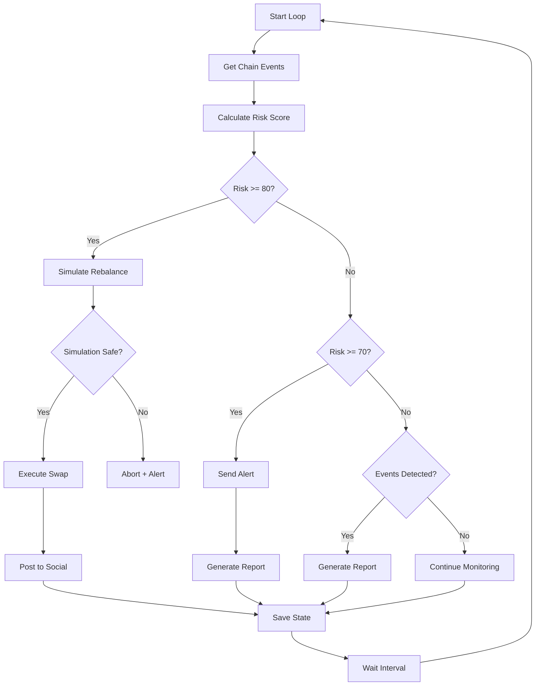

# Pharos Sentinel - Architecture Document

## Executive Summary

Pharos Sentinel is an autonomous on-chain intelligence agent built for the Pharos Skill-to-Agent Dual Cascade Hackathon. The system follows a modular skill-based architecture where 8 independent Skills (Phase 1) compose into a fully autonomous Agent (Phase 2).

---

## System Overview

### High-Level Architecture

```
┌─────────────────────────────────────────────────────────────────┐
│                    PHAROS SENTINEL AGENT                        │
├─────────────────────────────────────────────────────────────────┤
│                                                                 │
│  ┌──────────────┐                                              │
│  │ Orchestrator │◄────────── Decision Engine                   │
│  └──────┬───────┘                                              │
│         │                                                       │
│    ┌────┴────────────────────────────────────────────┐         │
│    │                                                 │         │
│    ▼                                                 ▼         │
│  ┌─────────────────────────────────────────────┐   ┌─────────┐ │
│  │           PHASE 1 SKILLS (8)                │   │ Memory  │ │
│  │                                             │   │ Store   │ │
│  │  ┌────────────┐  ┌────────────┐            │   └─────────┘ │
│  │  │ ChainWatch │  │ RiskScore  │            │               │
│  │  └────────────┘  └────────────┘            │               │
│  │  ┌────────────┐  ┌────────────┐            │               │
│  │  │Simulation  │  │SwapExecutor│            │               │
│  │  │  Guard     │  └────────────┘            │               │
│  │  └────────────┘  ┌────────────┐            │               │
│  │  ┌────────────┐  │Social      │            │               │
│  │  │Report      │  │Broadcast   │            │               │
│  │  │Writer      │  └────────────┘            │               │
│  │  └────────────┘  ┌────────────┐            │               │
│  │  ┌────────────┐  │Alert       │            │               │
│  │  │Memory      │  │Dispatch    │            │               │
│  │  │Store       │  └────────────┘            │               │
│  │  └────────────┘                            │               │
│  └─────────────────────────────────────────────┘               │
│                                                                 │
│         ▲                          ▲                           │
│         │                          │                           │
│  ┌──────┴───────┐          ┌──────┴───────┐                   │
│  │ Pharos RPC   │          │ Pharos Social│                   │
│  │ (WebSocket)  │          │ API          │                   │
│  └──────────────┘          └──────────────┘                   │
│                                                                 │
└─────────────────────────────────────────────────────────────────┘
```

---

## Phase 1: Independent Skills

### Skill Interface Contract

All skills implement the base `Skill<TInput, TOutput>` interface:

```typescript
interface Skill<TInput, TOutput> {
  name: string;
  version: string;
  description: string;
  execute(input: TInput): Promise<SkillResult<TOutput>>;
  validate(input: unknown): Promise<boolean>;
}

interface SkillResult<T> {
  success: boolean;
  data?: T;
  error?: string;
  metadata?: {
    executionTimeMs: number;
    timestamp: number;
    skillVersion: string;
  };
}
```

### Skill Catalog

| # | Skill Name | Category | On-Chain | Complexity | Submission Priority |
|---|------------|----------|----------|------------|---------------------|
| 1 | ChainWatch | Infrastructure | Yes (Read) | Medium | High |
| 2 | RiskScore | Intelligence | No | Low | High |
| 3 | SimulationGuard | Safety | Yes (Read) | High | Critical |
| 4 | SwapExecutor | Action | Yes (Write) | High | High |
| 5 | SocialBroadcast | Interaction | Yes (Write) | Medium | Medium |
| 6 | ReportWriter | Intelligence | No | Medium | Medium |
| 7 | AlertDispatch | Interaction | No | Low | High |
| 8 | MemoryStore | Infrastructure | Optional | Low | High |

---

## Detailed Skill Architectures

### 1. ChainWatch - Block Event Listener

**Purpose**: Real-time blockchain event monitoring

**Architecture**:
```
┌──────────────────────────────────────────┐
│           ChainWatch Skill               │
├──────────────────────────────────────────┤
│  Input Validator                         │
│       ↓                                  │
│  WebSocket Provider (Pharos RPC)         │
│       ↓                                  │
│  Block Scanner                           │
│       ↓                                  │
│  Event Filter (by address & type)        │
│       ↓                                  │
│  Event Normalizer                        │
│       ↓                                  │
│  Output Formatter                        │
└──────────────────────────────────────────┘
```

**Key Components**:
- WebSocketProvider for real-time subscriptions
- Event type detection via calldata signature analysis
- Configurable wallet watch list
- Block range scanning capability

**Dependencies**: ethers.js, Pharos RPC

---

### 2. RiskScore - Portfolio Risk Calculator

**Purpose**: Calculate composite risk score (0-100)

**Architecture**:
```
┌──────────────────────────────────────────┐
│           RiskScore Skill                │
├──────────────────────────────────────────┤
│  Holdings Parser                         │
│       ↓                                  │
│  ┌─────────────────────────────────┐    │
│  │   Risk Calculation Engine       │    │
│  │  ┌──────────┐ ┌──────────────┐ │    │
│  │  │Volatility│ │Concentration │ │    │
│  │  │ Analyzer │ │  (HHI)       │ │    │
│  │  └──────────┘ └──────────────┘ │    │
│  │  ┌──────────┐                  │    │
│  │  │Liquidity │                  │    │
│  │  │ Analyzer │                  │    │
│  │  └──────────┘                  │    │
│  └─────────────────────────────────┘    │
│       ↓                                  │
│  Weighted Aggregator (40/35/25)          │
│       ↓                                  │
│  Recommendation Generator                │
└──────────────────────────────────────────┘
```

**Risk Metrics**:
- **Volatility (40%)**: Standard deviation of price returns
- **Concentration (35%)**: Herfindahl-Hirschman Index
- **Liquidity (25%)**: Asset liquidity classification

**Dependencies**: None (pure computation)

---

### 3. SimulationGuard - Transaction Safety Simulator

**Purpose**: Pre-execution transaction simulation to prevent losses

**Architecture**:
```
┌──────────────────────────────────────────┐
│        SimulationGuard Skill             │
├──────────────────────────────────────────┤
│  Transaction Validator                   │
│       ↓                                  │
│  ┌─────────────────────────────────┐    │
│  │   Safety Check Pipeline         │    │
│  │                                 │    │
│  │  1. Basic Validation            │    │
│  │  2. Gas Estimation              │    │
│  │  3. eth_call Simulation         │    │
│  │  4. Price Impact Analysis       │    │
│  │  5. Balance Verification        │    │
│  │  6. Contract Safety Check       │    │
│  └─────────────────────────────────┘    │
│       ↓                                  │
│  Risk Aggregator                         │
│       ↓                                  │
│  Safe/Unsafe Decision + Warnings         │
└──────────────────────────────────────────┘
```

**Safety Checks**:
1. Address validation (not zero address, is contract)
2. Gas estimation (will transaction revert?)
3. Transaction simulation via `eth_call`
4. Price impact calculation for swaps
5. Balance sufficiency check
6. Contract verification status

**Dependencies**: ethers.js, Pharos RPC

---

### 4. SwapExecutor - DEX Transaction Executor

**Purpose**: Execute token swaps on Pharos DEX

**Architecture**:
```
┌──────────────────────────────────────────┐
│         SwapExecutor Skill               │
├──────────────────────────────────────────┤
│  Input Validator                         │
│       ↓                                  │
│  Token Contract Loader (decimals)        │
│       ↓                                  │
│  Amount Converter (to wei)               │
│       ↓                                  │
│  Router Contract Interface               │
│       ↓                                  │
│  ┌─────────────────────────────────┐    │
│  │   Execution Flow                │    │
│  │                                 │    │
│  │  1. Check Allowance             │    │
│  │  2. Approve if needed           │    │
│  │  3. Get Expected Output         │    │
│  │  4. Calculate Min Output        │    │
│  │  5. Build Swap Transaction      │    │
│  │  6. Sign & Broadcast            │    │
│  │  7. Wait for Confirmation       │    │
│  └─────────────────────────────────┘    │
│       ↓                                  │
│  Result Formatter                        │
└──────────────────────────────────────────┘
```

**Supported Operations**:
- swapExactTokensForTokens
- swapExactETHForTokens
- Token approval management

**Dependencies**: ethers.js, Pharos RPC, DEX Router ABI

---

### 5. SocialBroadcast - Social Feed Poster

**Purpose**: Post messages to Pharos social layer

**Architecture**:
```
┌──────────────────────────────────────────┐
│        SocialBroadcast Skill             │
├──────────────────────────────────────────┤
│  Message Formatter                       │
│  (add token mentions, tx references)     │
│       ↓                                  │
│  Signature Validator                     │
│       ↓                                  │
│  Pharos Social API Client                │
│       ↓                                  │
│  POST /posts                             │
│       ↓                                  │
│  Response Parser                         │
│       ↓                                  │
│  Post URL Generator                      │
└──────────────────────────────────────────┘
```

**Features**:
- Token mention formatting ($TOKEN)
- Transaction hash attachment
- Author signature verification
- Character limit enforcement (500 chars)

**Dependencies**: Pharos Social API

---

### 6. ReportWriter - AI Report Generator

**Purpose**: Generate human-readable portfolio reports using LLM

**Architecture**:
```
┌──────────────────────────────────────────┐
│         ReportWriter Skill               │
├──────────────────────────────────────────┤
│  Event Aggregator                        │
│       ↓                                  │
│  ┌─────────────────────────────────┐    │
│  │   Report Generation             │    │
│  │                                 │    │
│  │  ┌─────────────┐               │    │
│  │  │ OpenAI API  │──► JSON Parse │    │
│  │  │ (if avail)  │               │    │
│  │  └─────────────┘               │    │
│  │         OR                      │    │
│  │  ┌─────────────┐               │    │
│  │  │ Template    │               │    │
│  │  │ Engine      │               │    │
│  │  └─────────────┘               │    │
│  └─────────────────────────────────┘    │
│       ↓                                  │
│  Markdown Formatter                      │
└──────────────────────────────────────────┘
```

**Persona Modes**:
- Conservative: Risk-focused language
- Aggressive: Opportunity-focused language
- Neutral: Balanced factual reporting

**Dependencies**: OpenAI API (optional), falls back to templates

---

### 7. AlertDispatch - Notification System

**Purpose**: Send alerts via multiple channels when thresholds breached

**Architecture**:
```
┌──────────────────────────────────────────┐
│        AlertDispatch Skill               │
├──────────────────────────────────────────┤
│  Rule Parser                             │
│       ↓                                  │
│  ┌─────────────────────────────────┐    │
│  │   Rule Evaluation Loop          │    │
│  │                                 │    │
│  │  For each rule:                 │    │
│  │    1. Get metric value          │    │
│  │    2. Compare with threshold    │    │
│  │    3. If triggered → notify     │    │
│  └─────────────────────────────────┘    │
│       ↓                                  │
│  ┌─────────────────────────────────┐    │
│  │   Channel Dispatchers           │    │
│  │  ┌────────┐ ┌────────┐ ┌──────┐│    │
│  │  │Telegrm │ │Discord │ │Webhk ││    │
│  │  └────────┘ └────────┘ └──────┘│    │
│  └─────────────────────────────────┘    │
└──────────────────────────────────────────┘
```

**Supported Operators**: >, <, >=, <=, ==

**Channels**:
- Telegram (bot API)
- Discord (webhooks)
- Webhook (generic HTTP POST)

**Dependencies**: axios, channel-specific APIs

---

### 8. MemoryStore - State Persistence

**Purpose**: Persistent key-value storage for agent state

**Architecture**:
```
┌──────────────────────────────────────────┐
│         MemoryStore Skill                │
├──────────────────────────────────────────┤
│  Operation Router                        │
│  (get/set/delete/append)                 │
│       ↓                                  │
│  ┌─────────────────────────────────┐    │
│  │   Storage Backend               │    │
│  │                                 │    │
│  │  ┌────────┐                     │    │
│  │  │ In-Mem │ ◄── Default        │    │
│  │  └────────┘                     │    │
│  │  ┌────────┐                     │    │
│  │  │ Redis  │ ◄── Production     │    │
│  │  └────────┘                     │    │
│  │  ┌────────┐                     │    │
│  │  │ Chain  │ ◄── Future         │    │
│  │  └────────┘                     │    │
│  └─────────────────────────────────┘    │
│       ↓                                  │
│  Response Formatter                      │
└──────────────────────────────────────────┘
```

**Operations**:
- `get`: Retrieve value by key
- `set`: Store value with timestamp
- `delete`: Remove key
- `append`: Add to array (for history)

**Helper Methods**:
- `saveDecision()`: Store agent decisions
- `getDecisionHistory()`: Retrieve last N decisions
- `saveAgentState()`: Persist full agent state
- `getAgentState()`: Restore agent state

**Dependencies**: None (in-memory), optional Redis

---

## Phase 2: Agent Orchestration

### Agent Architecture

```
┌─────────────────────────────────────────────────────┐
│              SENTINEL AGENT LOOP                    │
├─────────────────────────────────────────────────────┤
│                                                     │
│   ┌───────────────────────────────────────────┐    │
│   │           Monitoring Loop                 │    │
│   │                                           │    │
│   │  1. Get Chain Events (ChainWatch)         │    │
│   │         ↓                                 │    │
│   │  2. Calculate Risk (RiskScore)            │    │
│   │         ↓                                 │    │
│   │  3. Make Decision (Orchestrator)          │    │
│   │         ↓                                 │    │
│   │  4. Execute Action                        │    │
│   │         ↓                                 │    │
│   │  5. Save State (MemoryStore)              │    │
│   │         ↓                                 │    │
│   │  [Wait for next interval]                 │    │
│   └───────────────────────────────────────────┘    │
│                                                     │
│   Decision Matrix:                                  │
│   ┌──────────────┬──────────────────────────┐      │
│   │ Risk Level   │ Action                   │      │
│   ├──────────────┼──────────────────────────┤      │
│   │ >= 80        │ Auto-rebalance + Social  │      │
│   │ 70-79        │ Alert + Report           │      │
│   │ < 70 + events│ Periodic Report          │      │
│   │ Otherwise    │ Continue Monitoring      │      │
│   └──────────────┴──────────────────────────┘      │
│                                                     │
└─────────────────────────────────────────────────────┘
```

### Decision Flow



---

## Data Flow Diagrams

### Event Processing Flow

```
User Wallet ──► Pharos Chain ──► ChainWatch ──► Events Array
                                                      │
                                                      ▼
                                               RiskScore
                                                      │
                                                      ▼
                                               Decision Engine
                                                      │
                    ┌─────────────────────────────────┼─────────────────┐
                    │                                 │                 │
                    ▼                                 ▼                 ▼
              SimulationGuard                  AlertDispatch      ReportWriter
                    │                                 │                 │
                    ▼                                 ▼                 ▼
              SwapExecutor                    Telegram/Discord    SocialBroadcast
                    │                                                 │
                    ▼                                                 ▼
              Pharos Chain                                    Pharos Social
```

---

## Security Considerations

### Private Key Management

- Keys stored ONLY in environment variables
- Never logged or persisted
- Used exclusively in SwapExecutor

### Transaction Safety

- All transactions simulated before execution
- Slippage protection enforced
- Balance checks performed
- Contract verification attempted

### Rate Limiting

- API calls rate-limited per channel
- Blockchain queries cached where possible
- WebSocket connections pooled

---

## Scalability Design

### Horizontal Scaling

- Each skill is stateless (except MemoryStore)
- Multiple agent instances can share MemoryStore backend
- Skills can be distributed across microservices

### Performance Optimizations

- WebSocket subscriptions instead of polling
- Cached price data with TTL
- Batch event processing
- Async skill execution where possible

---

## Technology Stack

| Component | Technology | Justification |
|-----------|------------|---------------|
| Runtime | Node.js 18+ | Async I/O, Ethereum ecosystem standard |
| Language | TypeScript | Type safety, better DX |
| Blockchain | ethers.js v6 | Modern API, good TS support |
| Validation | Zod | Runtime type checking |
| HTTP Client | axios | Promise-based, interceptors |
| AI | OpenAI API | Best-in-class LLM |
| Testing | Jest | Fast, good TS support |
| Build | tsc | Native TypeScript compiler |

---

## Deployment Architecture

### Development

```
Local Machine
├── TypeScript Source
├── Hot Reload (ts-node)
└── Mock APIs
```

### Production

```
Cloud Provider (AWS/GCP)
├── Containerized Agent (Docker)
├── Redis Cluster (MemoryStore)
├── Load Balancer
└── Monitoring (Prometheus/Grafana)
```

---

## Monitoring & Observability

### Metrics Tracked

- Skill execution times
- Success/failure rates
- Agent decision distribution
- Risk score trends
- Transaction outcomes

### Logging Strategy

- Structured JSON logs
- Correlation IDs per decision cycle
- Separate log streams per skill
- Error aggregation

---

## Future Enhancements

1. **Multi-Chain Support**: Extend to other EVM chains
2. **ML Risk Model**: Replace heuristic model with trained ML
3. **DAO Governance**: Community-managed risk parameters
4. **Insurance Pool**: Auto-purchase coverage on high-risk actions
5. **NFT Integration**: Monitor NFT portfolio risk

---

## Appendix: API Specifications

### Skill Input/Output Schemas

See `packages/shared/types.ts` for complete Zod schemas.

### Environment Variables

```bash
# Required
PHAROS_RPC_URL=https://rpc.pharosnetwork.xyz
PHAROS_WSS_URL=wss://rpc.pharosnetwork.xyz/ws

# Optional
OPENAI_API_KEY=sk-...
TELEGRAM_BOT_TOKEN=bot_token
TELEGRAM_CHAT_ID=@channel
DEFAULT_WEBHOOK_URL=https://...
WALLET_KEY=0x...  # Phase 2 only
```

---

*Document Version: 1.0*
*Last Updated: June 2024*
*Author: Pharos Sentinel Team*
